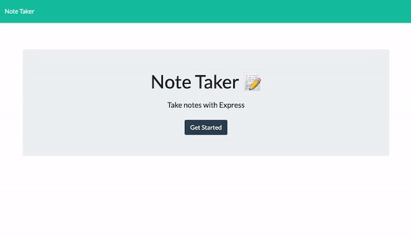

# Dan-Smith-11-Team-Profile-Generator-OOP-NodeJS

**Description**
---

This app allows users to save and delete notes that they have written. 

The app uses express to store the notes on an express server in a JSON file.

When a user makes a new note a POST request is made to send the data to the JSON file.

A GET request is made on page load and when a user saves a new note to show the notes from the JSON file to the user.

The app also allows users to delete their previous notes. Each note is given a unique ID upon creation. This ID is then assigned as a part of the HTML elements' data. When a user clicks the delete button on a note, the app registers the note ID and makes a DELETE request parsing through this unique ID. The JSON file is then recreated without the note that the user wished to delete and a GET request is made to render the updated notes for the user.

**Website**
---

The website is hosted using Heroku at the link below.

Website link:
https://protected-taiga-81063.herokuapp.com/
